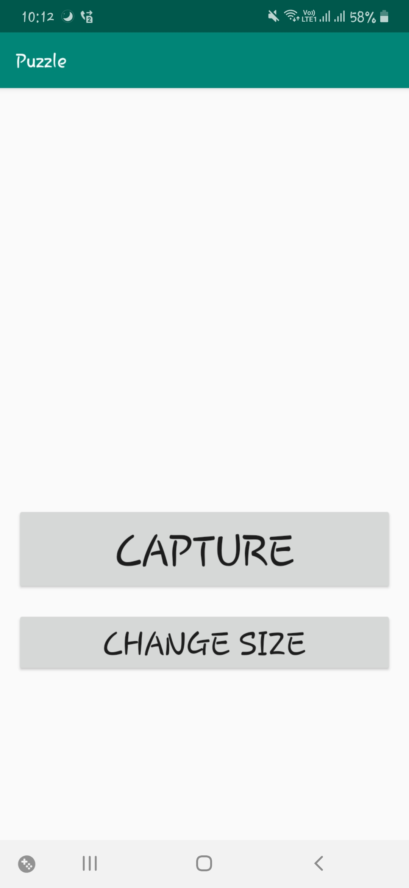
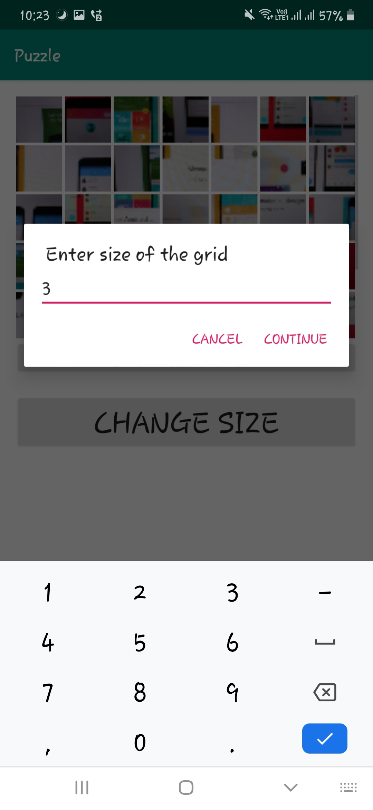
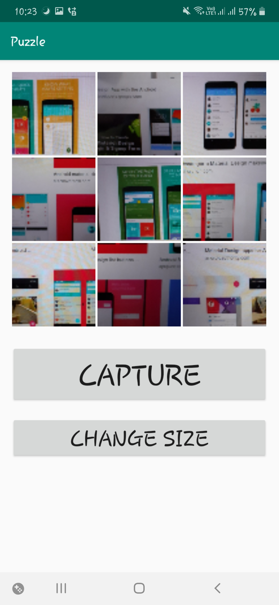
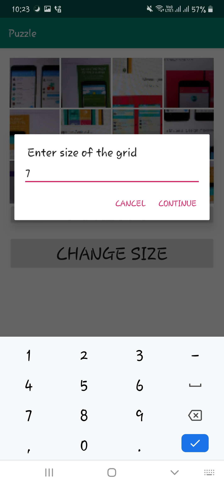
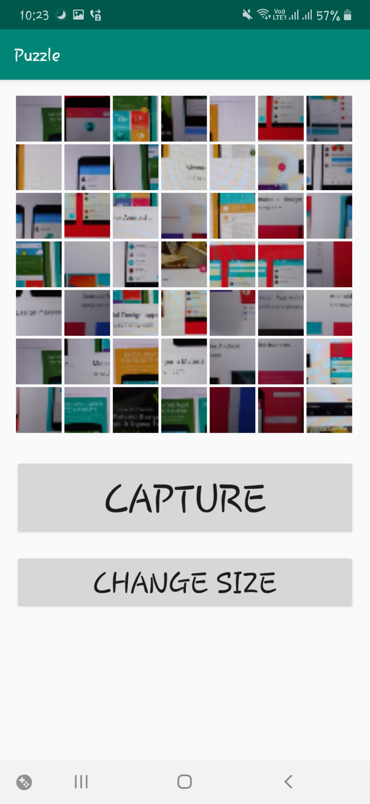
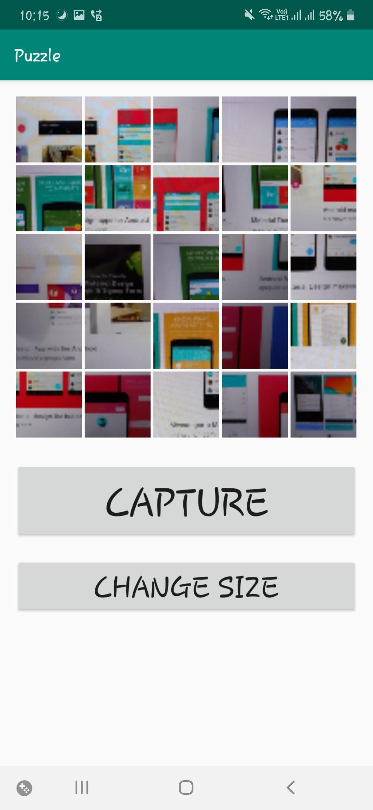
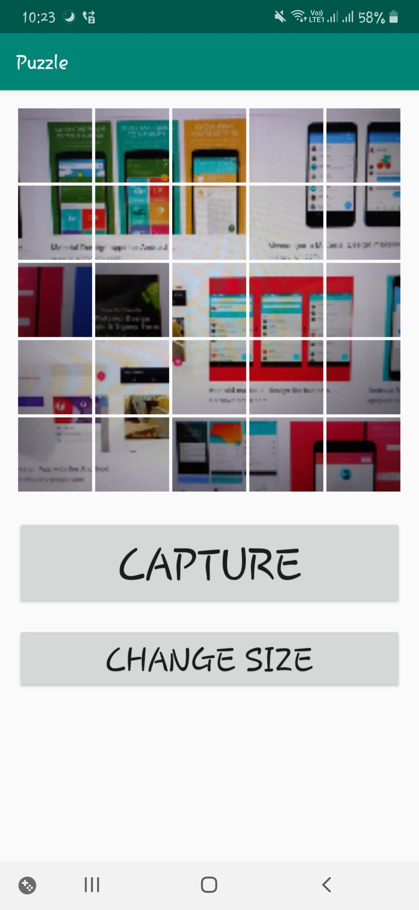

# Puzzle

An android game which creates dynamic puzzle of n*n by taking picture through cameras and user can input the size of grid.

## Screenshots

<table>
  <tr>
    <td></td>
    <td></td>
    <td></td>
  </tr>
  <tr>
    <td></td>
    <td></td>
    <td></td>
  </tr>
  <tr>
    <td></td>
  </tr>
</table>
